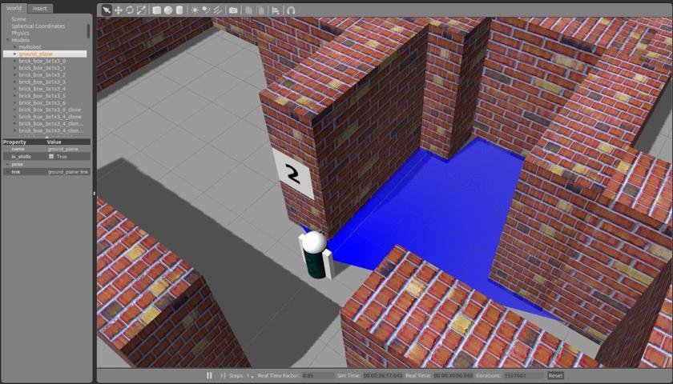
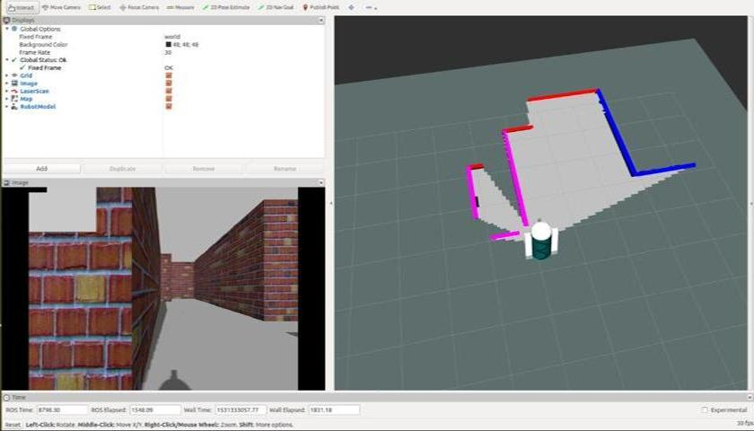
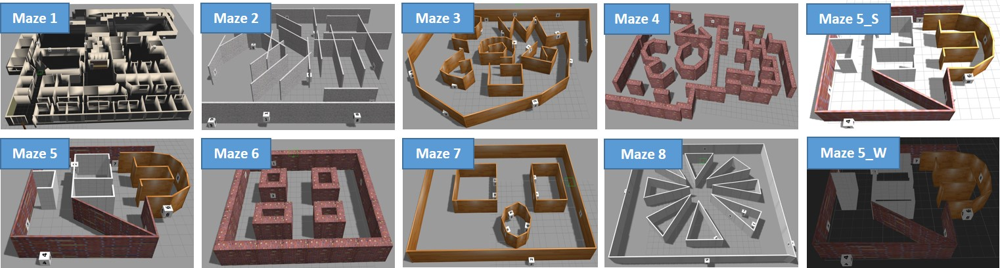

# Egocentric Spatial Memory

This repository contains an implementation of Egocentric Spatial Memory by Mengmi Zhang, Keng Teck Ma, Shih-Cheng Yen, Joo Hwee Lim, Qi Zhao, and Jiashi Feng, to present at IROS 2018. 

An unofficial copy is downloadable [Here](https://media.wix.com/ugd/d2b381_b48aa16a715b4826947d7d5ae383a8a6.pdf).

## Project Description

Egocentric spatial memory (ESM) defines a memory system with encoding, storing, recognizing and recalling the spatial information about the environment from an egocentric perspective.	We introduce an integrated deep neural network architecture for modeling ESM. It learns to estimate the occupancy state of the world and progressively construct top-down 2D global maps from egocentric views in a spatially extended environment. During the exploration, our proposed ESM model updates belief of the global map based on local observations using a recurrent neural network. It also augments the local mapping with a novel external memory to encode and store latent representations of the visited places over long-term exploration in large environments which enables agents to perform place recognition and hence, loop closure. 

Here is a quick demo (left to right: egocentric camera view, ground truth and predicted maps at the current time step, ground truth and predicted accumulative local maps, ground truth and predicted accumulative global maps). Note: the agent takes ground truth pose and the egocentric camera view as inputs. All maps are visualized in top-view. There is only mapping involved without loop closure classification or map correction.


## Simulation Environments

We used two datasets for training our ESM model: 2D3DS dataset [here](http://buildingparser.stanford.edu/dataset.html) and our own virtual mazes. All 3D envrionments are loaded in Gazebo simulator in ROS. Agent moves in these environments based on pre-defined trajectories. Agent uses the 2D laser scanner to collect ground truth data for training. All the 3D environments are downloadable [Here](https://drive.google.com/file/d/1lcqF2PByz4i8B1b4wpctzgRuNXtE_JXK/view?usp=sharing). Screenshots for Gazebo simulator on the agent navigating in the environment and RVIZ on visualizing local maps and laser scanning data:

| [](gif/Capture2.JPG)  | [](gif/Capture1.JPG) 
|:---:|:---:|
| Gazebo | RVIZ | 

### 2D3DS dataset
We extracted their 3D environment files (area 1 - 6) including their ```.dae``` file and their corresponding textures and created ```.world``` files for Gazebo loading in ```world/berkley*``` folder. See download link above. 

### Virtual maze dataset
We created 8 virtual mazes with different wall textures, maze geometries and lighting conditions and saved them as ```.world``` file. ```world*wd.world``` denotes environments with digits pasted on walls. See download link above. Sample maze snapshot:

 

## Data Collection in ROS
Our code has been test in ROS jade version. See ```ROS_readme.txt``` for detailed instructions. Breifly, loading 3D models in Gazebo, spawning URDF robots:
```
roslaunch worldDescription worldlaunchIROS.launch
```
Pre-defining agents' trajectories using keyboard control:
```
rosrun worldDescription KeyboardControl
```
Contruscting local maps:  
```
roslaunch worldDescription localMap.launch
```
Moving agents in environemnts using pre-defined trajectories and collecting camera data:
```
rosrun worldDescription MoveRobot
```
Go to ```matlab/preprocess/``` and see ```matlab/preprocess/readme.txt``` for pre-processing collected local maps in ROS.

## Training and testing EMS model in Torch7

The code requires a Torch7 installation and GPU. 

Matio package is required (save and load matlab arrays from Torch). Refer to [link](https://github.com/soumith/matio-ffi.torch) for installation. 

Stn package is required (spatial transformer module). Refer to [link](https://github.com/qassemoquab/stnbhwd) for installation.

Clone the repository
```
https://github.com/Mengmi/Egocentric-Spatial-Memory.git
```
After data collection step in ROS, you should have all the data ready for training the network and start testing:
In ```/torchMM```:

Run "GenerateDataBaseUCB_IROS.lua" to convert ```mat``` files as ```t7``` files. A complete list of ```datalist``` files are downloadable [here](https://drive.google.com/open?id=1yTDMc7UudvmbOv-P2D9SowDsc6gG894x)

Run "UCB_saveInput_IROS.lua" to pre-process the data and store ground truth data in batches of size 10 and time steps 32

Run "UCB_m18_IROS.lua" to train a 2D-ConvNet based on ground truth binary local map at the current time step

Run "UCB_m20_IROS.lua" to load ucb_m18 model in recurrent neural network for integrating current predictions to generate accumulative local maps

Run "Triplet_m7.lua" to train the place unit using triplet loss

Run "testTriplet_m7.lua" to test the triplet network and perform loop closure classification

Run "testUCB_m18_IROS.lua" to test the predicted map at the current step based on the current camera frame

Run "testUCB_m20_extend_IROS.lua" to test the local mapper (recurrent neural network) and generate accumulative local maps for the past 32 frames

Run "testUCB_m20_global_new_IROS.lua" to store the local maps in global maps

## Pre-trained models

One can skip the training part and download our pre-trained models from [here](https://drive.google.com/open?id=1d19BO_oRkLoKsqr42HIJFQVMtYn4li3h). Note that ```*_new``` folders are for models trained on virtual mazes and ```*_IROS``` folders are for models first trained on virtual mazes and then fine-tuned on 2D3DS dataset.

## Visualizing results in Matlab

Go to ```matlab/eval/``` folder for visualizing predicted global, local maps and produce quantative evaluation results. See ```matlab/eval/readme.txt``` for detailed file descriptions.

## Notes

The source code is for illustration purpose only. One might have to change the path in files in order to run the scripts. Our github code has been focusing on 2D3DS dataset. One might need to adjust accordingly for virtual maze dataset.

## License

National University of Singapore, Singapore

Institute for Infocomm Research, A*STAR, Singapore

